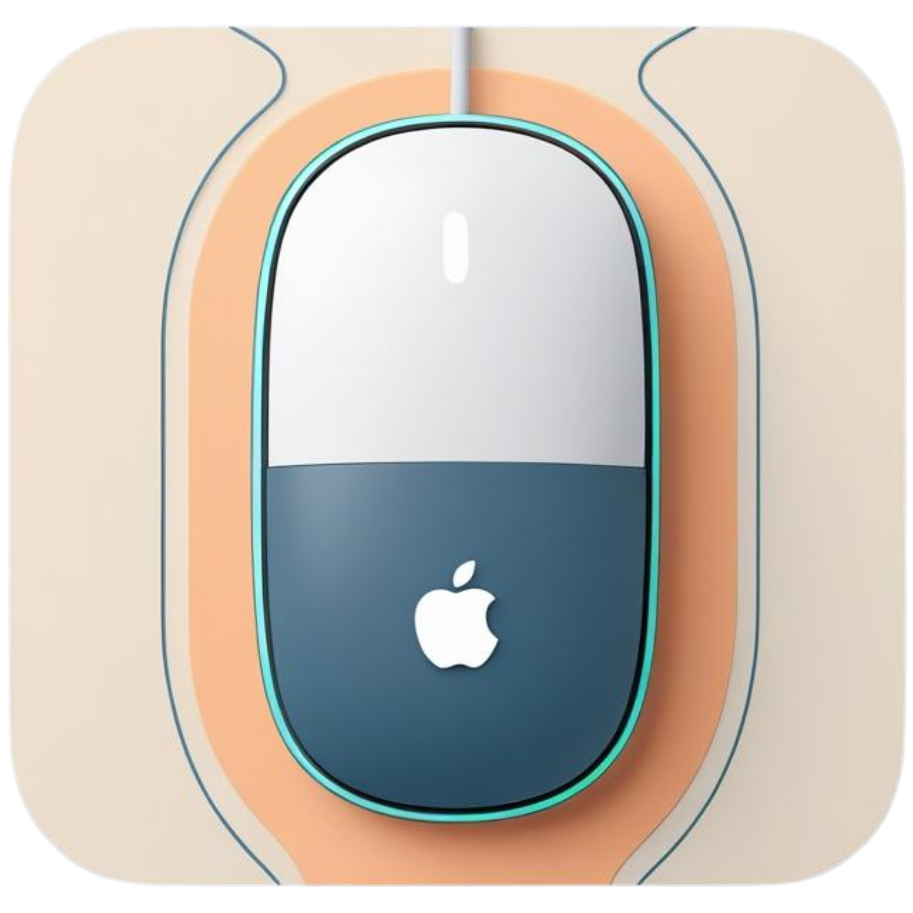
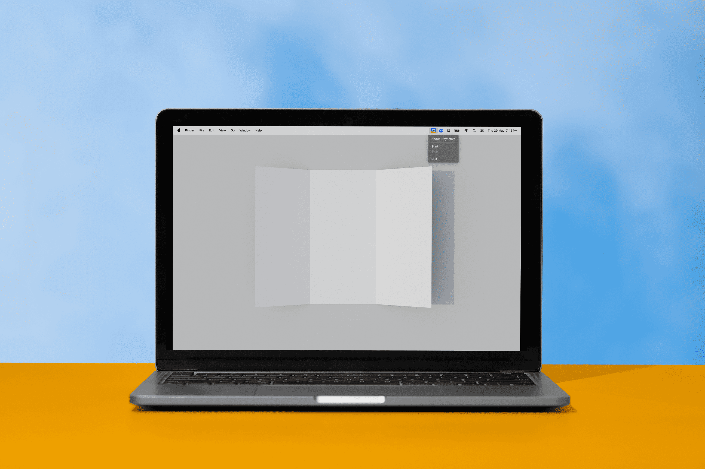

# KeepMacAwake

<p align="center">
  
</p>

<h1 align="center">Keep Your Mac Awake. Effortlessly.</h1>

<p align="center">
  A simple macOS utility to keep your Mac active and always online.
  <br>
  Prevent frustrating interruptions during long downloads, builds, or passive tasks. KeepMacAwake silently keeps your Mac awake by gently simulating mouse movement, ensuring your screen stays on and communication apps remain active. Enjoy uninterrupted workflows without the hassle.
</p>

<p align="center">
  <a href="https://github.com/zeeshan1112/KeepMacAwake/releases/latest"></a>
  <a href="https://github.com/zeeshan1112/KeepMacAwake/issues"></a>
  <a href="https://github.com/zeeshan1112/KeepMacAwake/stargazers"></a>
  <a href="https://paypal.me/zeeshanahmad123"></a>
</p>

---

## 📸 Screenshots

<p align="center">
  
</p>

---

## ✨ Features You'll Love

KeepMacAwake is engineered for seamless integration and maximum efficiency on macOS.

* **Completely Discreet:** It works silently in the background without any visible cursor movements or intrusive notifications. Your workflow remains uninterrupted.
* **Feather-Light:** Built for minimal resource consumption. KeepMacAwake runs quietly, ensuring your Mac's performance isn't compromised.
* **System Optimized:** Designed and optimized specifically for macOS, providing reliable and stable operation across all supported versions.
* **Privacy First:** No data collection, no network activity. Your privacy is paramount. KeepMacAwake simply does its job, locally.

---

## 🚀 Get Started in Minutes!

### 1. Download KeepMacAwake

Choose the correct version for your Mac's chip:

* **[Download for Apple Silicon (M1/M2/M3 Macs)](https://github.com/zeeshan1112/KeepMacAwake/releases/latest/download/KeepMacAwake_1.0.1_AppleSilicon.dmg)**
* **[Download for Intel Mac](https://github.com/zeeshan1112/KeepMacAwake/releases/latest/download/KeepMacAwake_1.0.1_Intel.dmg)**

> 💡 **Not sure which chip your Mac has?**
> Click the **Apple menu** () in the top-left corner of your screen and choose **"About This Mac."** Look for "Chip" or "Processor."

### 2. Install & Initial Launch

1.  Open the downloaded `.dmg` file and drag **KeepMacAwake.app** to your Applications folder.

> ⚠️ **First Launch Warning (Gatekeeper):**
> The first time you launch KeepMacAwake, macOS Gatekeeper might prevent it from opening because the app is downloaded from the internet and not from the Mac App Store.
>
> To bypass this:
> 1.  **Try opening directly:**
>     * **Right-click** (or Control-click) on **KeepMacAwake.app** in your Applications folder.
>     * Select **"Open"** from the context menu.
>     * A dialog box should appear with an **"Open"** button. Click it to confirm.
> 2.  **If the "Open" button is not present in the dialog:**
>     * Go to **System Settings** (or System Preferences).
>     * Click on **Privacy & Security** in the sidebar.
>     * In the "Security" section at the top, you should see a message about "KeepMacAwake" being blocked. Click the **"Open Anyway"** button next to this message. You'll likely be prompted to confirm again.
>
> You should only need to do this bypass once.

### 3. Grant Essential Permissions

For KeepMacAwake to function correctly and seamlessly, you need to grant it **Accessibility permission**. This allows it to perform the subtle mouse movements that keep your Mac active.

#### Granting Accessibility Permission (Required for Mouse Movement)

1.  Go to **System Settings** (or **System Preferences**).
2.  Click on **Privacy & Security** in the sidebar.
3.  Scroll down and click on **Accessibility**.
4.  You may need to click the **unlock icon** in the bottom left corner and enter your administrator password.
5.  In the list, find **"KeepMacAwake."**
    * If it's there, ensure its checkbox is **ticked (enabled)**.
    * If it's *not* there, click the **`+` (plus) button**, navigate to your `/Applications` folder, select **"KeepMacAwake.app"**, and click **"Open"**. Then, make sure its checkbox is **ticked**.
6.  Close System Settings.
7.  If KeepMacAwake was already running, **restart the app** from your menu bar for the changes to take effect.

#### Allowing Notifications (Optional)

KeepMacAwake can send simple notifications to inform you when it starts and stops.

1.  Go to **System Settings** (or **System Preferences**).
2.  Click on **Notifications**.
3.  Scroll down to **"KeepMacAwake"** in the app list.
4.  Click on it and adjust its notification settings to your preference (e.g., enable "Allow Notifications," choose "Banners" or "Alerts").

---

## 💡 How to Use

Once installed and permissions are granted:

1.  Launch **KeepMacAwake.app** from your Applications folder.
2.  Look for the **KeepMacAwake icon** in your macOS menu bar.
3.  Click the icon to reveal the menu:
    * **Start:** Activates the subtle mouse movement to keep your Mac active. The menu item will show "Running..."
    * **Stop:** Halts the mouse movement.
    * **About KeepMacAwake:** Opens this GitHub repository.
    * **Quit:** Exits the application.

---

## 🧪 Development

Interested in contributing or building KeepMacAwake yourself? Here's how:

```bash
git clone [https://github.com/zeeshan1112/KeepMacAwake.git](https://github.com/zeeshan1112/KeepMacAwake.git)
cd KeepMacAwake
python3 -m venv venv
source venv/bin/activate
pip install -r requirements.txt
python setup.py py2app   # To build the macOS application
```

---

## 🙏 Support KeepMacAwake

Your contribution fuels future improvements and new features. If you find KeepMacAwake useful, please consider supporting its development:

* **[Buy Me a Coffee! (PayPal)](https://paypal.me/zeeshanahmad123)**

---

## 💬 Contact & Issues

Have questions, suggestions, or just want to say hello?

* For technical issues or feature requests, please **[open an Issue on GitHub](https://github.com/zeeshan1112/KeepMacAwake/issues)**.
* For other inquiries, you can use the contact form on our [official website](https://zeeshan1112.github.io/stayactive-landing).

---

## 📄 License

This project is licensed under a **custom non-commercial license**. - see the [LICENSE](LICENSE.txt) file for details.

---

## © Copyright

Copyright © 2025 Zeeshan Ahmad. All Rights Reserved.